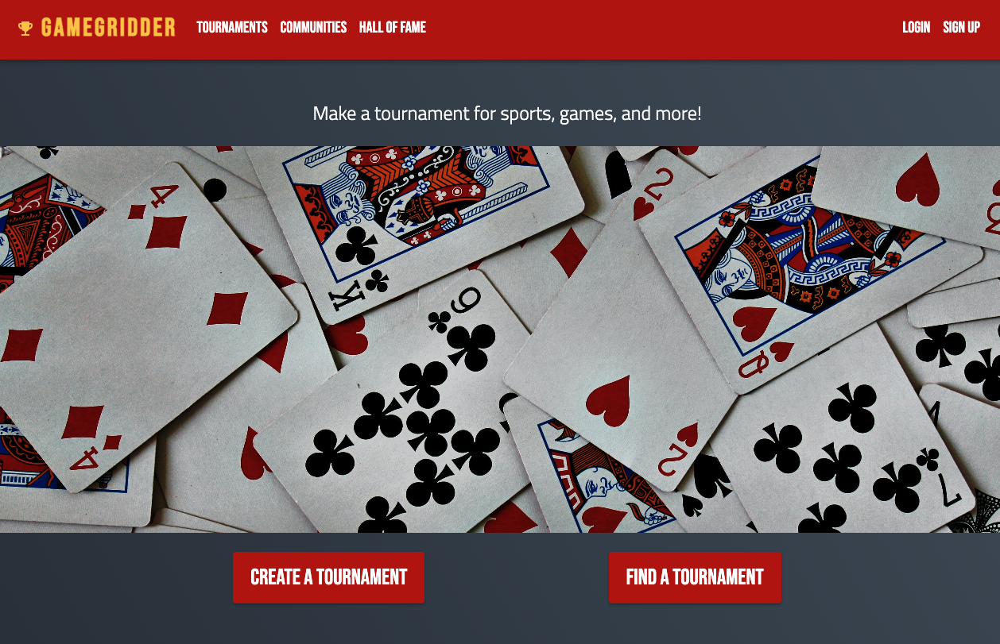
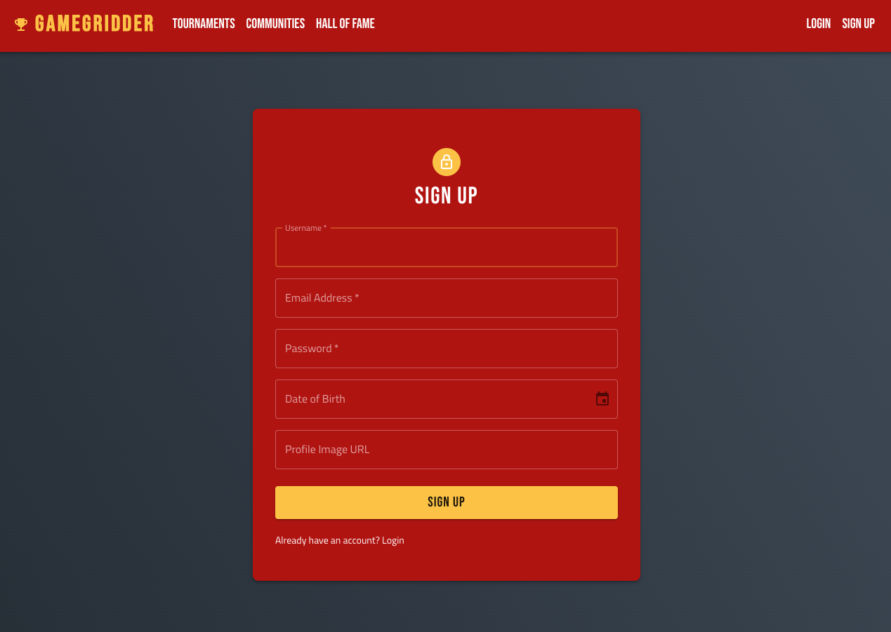
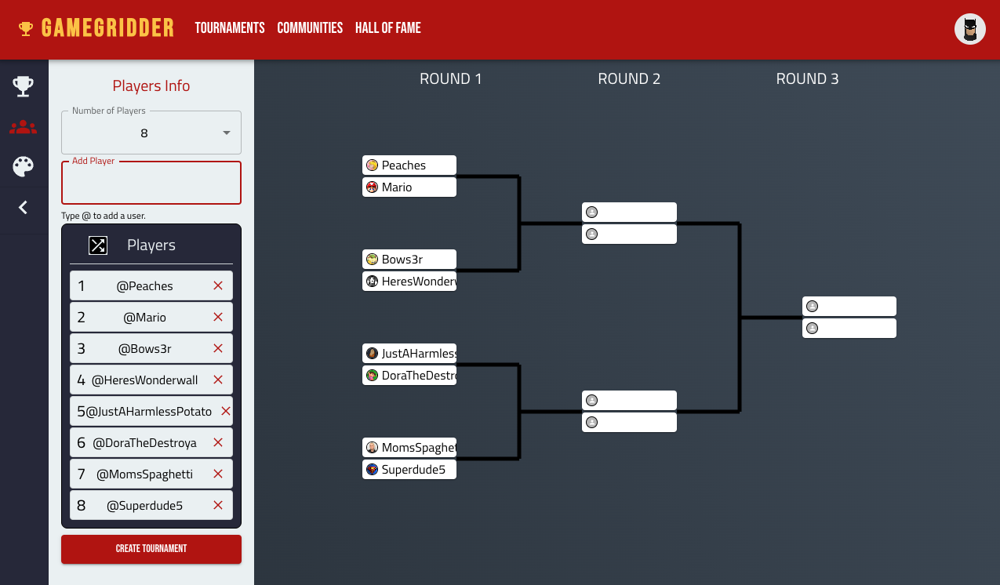
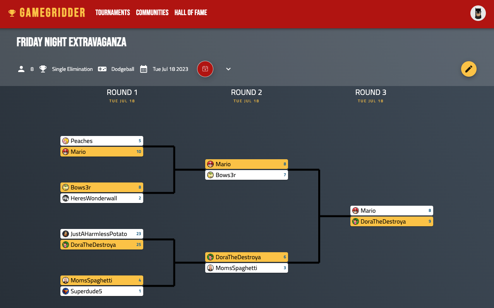

# GameGridder
A tournament bracket creator app. Create a single-elimination tournament as a logged in user and have access to update scores and find out the winner! The bracket automatically advances players with the highest score to the next round.

## Dependencies
* React
* React Router DOM
* Material UI
* Node.js
* Express
* PostgreSQL
* Axios
* SASS

## Screenshots

Homepage

User registration page

Create tournament page

Tournament bracket page
